# mermaid サンプル

#### Mermaid Official document
[https://mermaid.js.org/syntax/flowchart.html](https://mermaid.js.org/syntax/flowchart.html)

## Flowchart

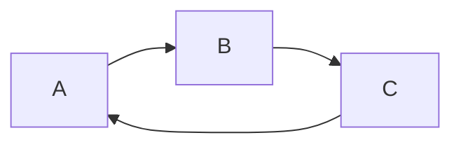

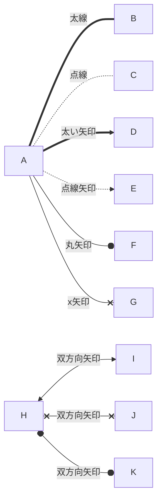

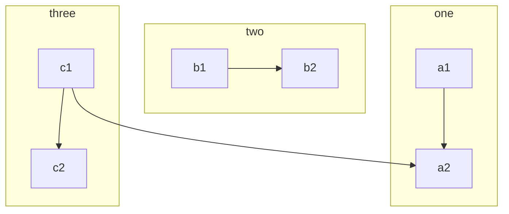

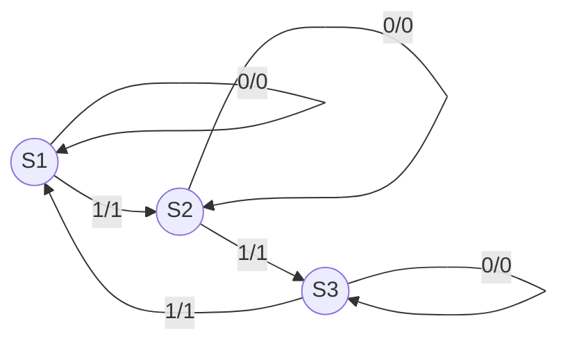

## Sequence
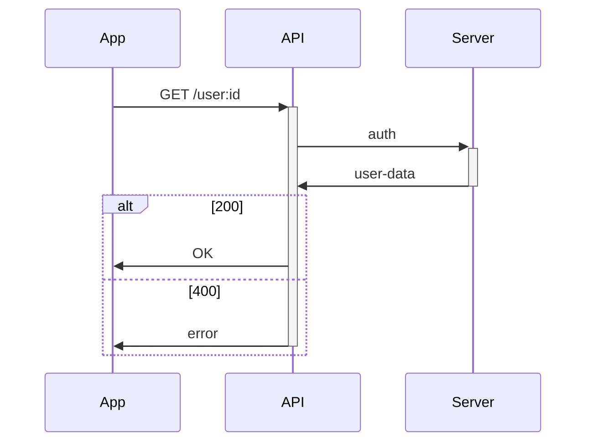
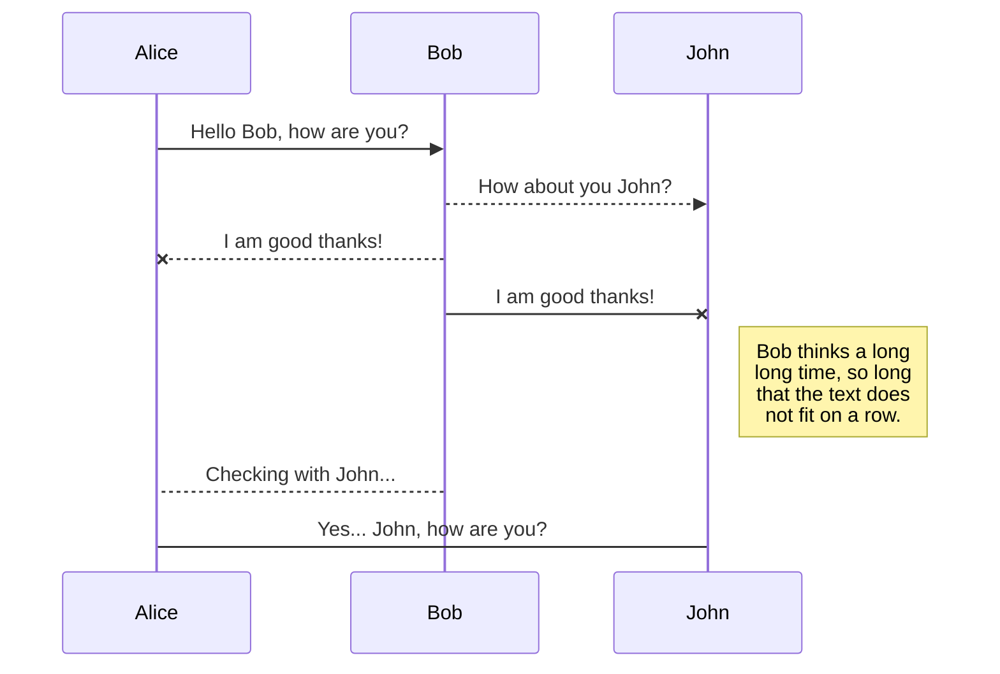

## ER diagram
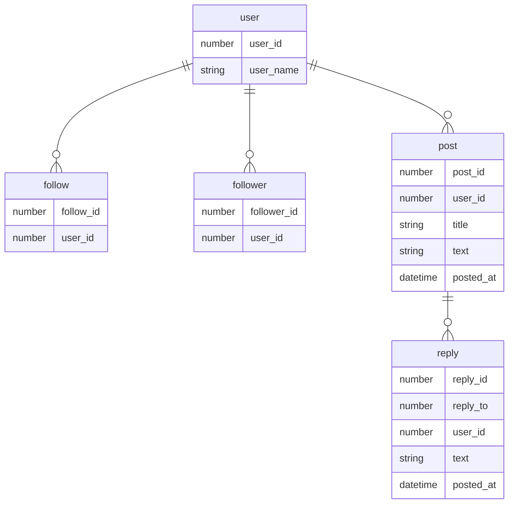

## Gantt chart
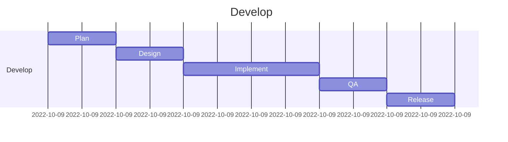

## Pie chart
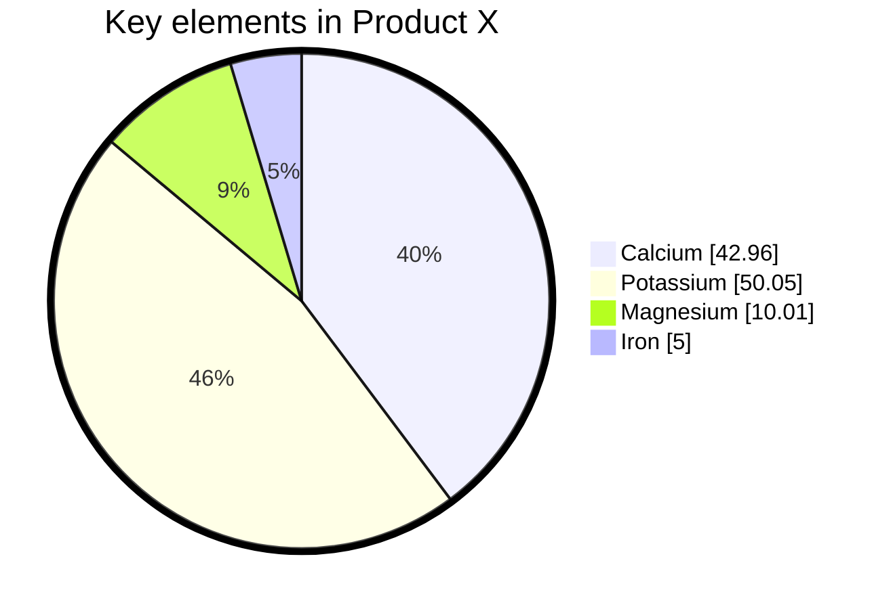

## Quadrant chart
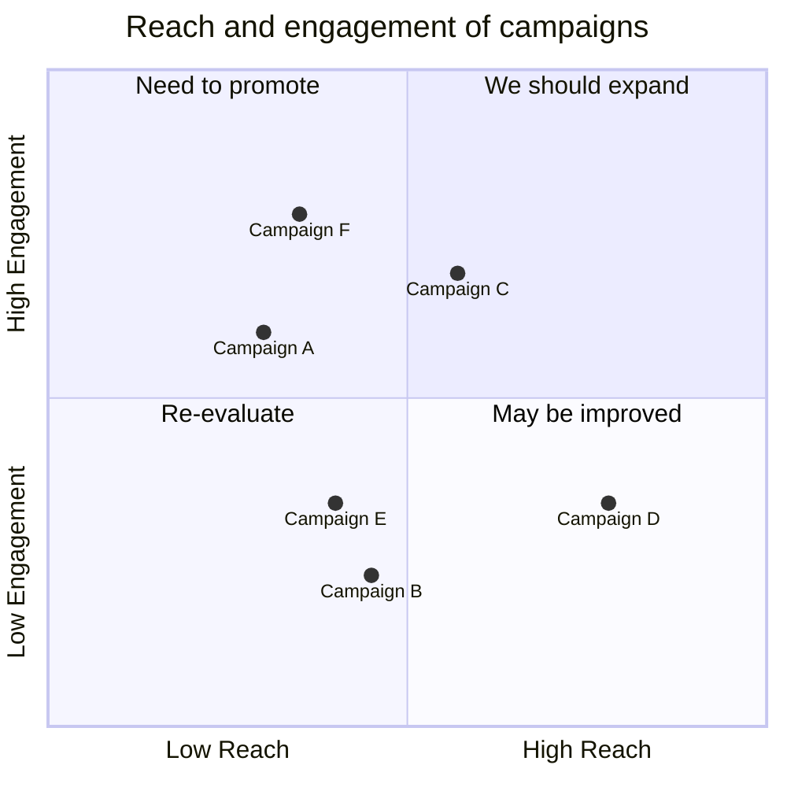

## Mind map
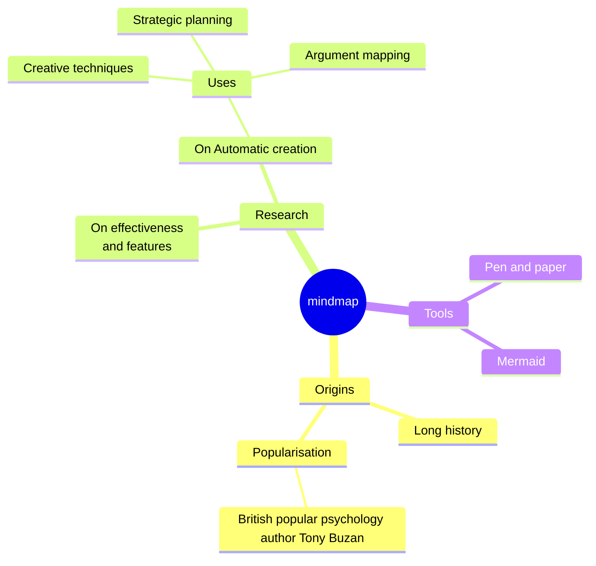

## Sankey diagram
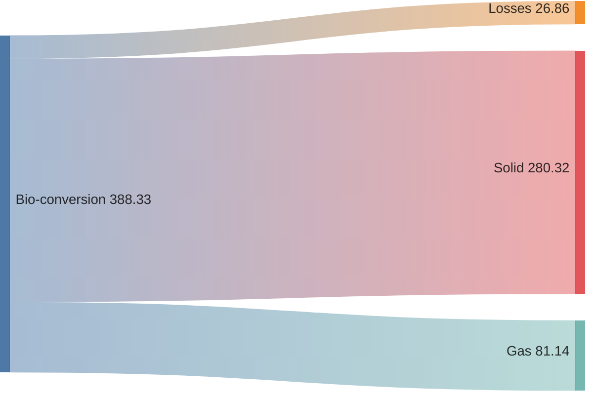

## Architecture diagram
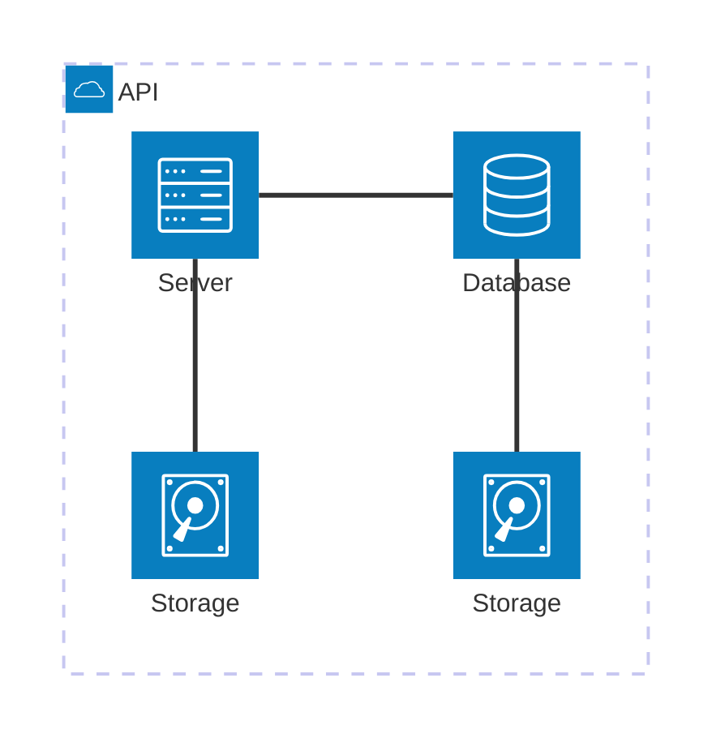